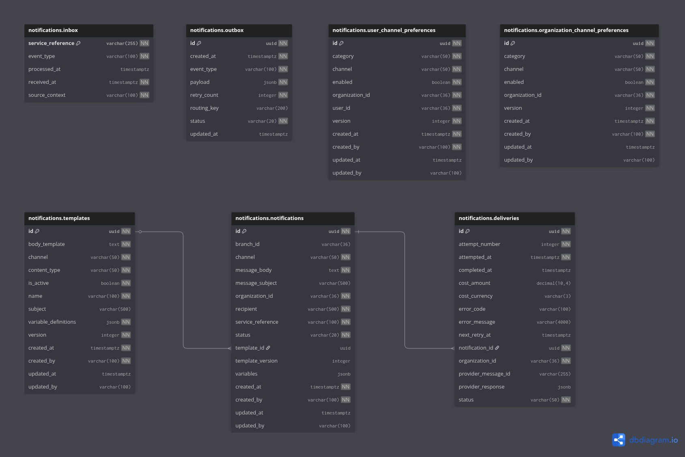

# eBikes Africa — Notifications Service

> Manages multichannel notification delivery for the eBikes Africa platform — from template management and preference gating through to channel dispatch, delivery tracking, and outbox event reliability.

---

## Overview

The Notifications service is the authoritative delivery layer for all outbound communications within the eBikes Africa platform. It governs the full lifecycle of a notification — from inbound event receipt and preference checking through template rendering, channel routing, and delivery outcome recording. Upstream services trigger notifications by publishing events to RabbitMQ; this service consumes those events and owns what happens next.

Notifications are channel-agnostic by design: the same pipeline handles Email, SMS, WhatsApp, and SSE (Server-Sent Events) through pluggable channel services, each conditionally enabled via configuration. Templates are stored and versioned in the database; message bodies and subjects are rendered at dispatch time using Thymeleaf. An outbox pattern ensures audit events are reliably published downstream even under partial failure.

**Owns:**

- Notification template management (create, version, activate/deactivate)
- Inbound event deduplication via inbox idempotency table
- User and organisation channel preference management
- Notification creation, status lifecycle, and delivery attempt tracking
- Multi-channel dispatch: Email (AWS SES), SMS (Taifa Mobile), WhatsApp (Meta), SSE
- Outbox event log and retry management
- Audit event publishing for all state transitions

**Does not own:**

- User identity and provisioning — belongs to Identity / Keycloak
- Organisation creation and structure — belongs to Organisation service
- Assignment and routing logic — belongs to Assignment service
- Payment processing — belongs to Payment & Billing
- Message content authoring — upstream services supply template name and variables

---

## Platform Context

| Relationship | Service      | How                                                                              |
|--------------|--------------|----------------------------------------------------------------------------------|
| Consumed by  | All          | Upstream services publish `NotificationRequest` events via RabbitMQ              |
| Consumes     | Identity     | `UserProvisionedEvent` — seeds default user channel preferences on user creation |
| Consumes     | Organisation | `OrganizationCreatedEvent` — seeds default organisation channel preferences      |
| Consumes     | Any upstream | `NotificationRequest` routing keys prefixed `notifications.*`                    |
| Publishes to | All          | Audit events via RabbitMQ outbox pattern                                         |
| Auth via     | Keycloak     | JWT / OIDC — all endpoints require Bearer token                                  |
| Storage      | PostgreSQL   | Templates, notifications, deliveries, preferences, inbox, outbox                 |

---

## Tech Stack

| Concern   | Technology                        |
|-----------|-----------------------------------|
| Language  | Java 21                           |
| Framework | Spring Boot 3.x                   |
| Database  | PostgreSQL (Liquibase migrations) |
| Messaging | RabbitMQ (outbox pattern)         |
| Auth      | Keycloak (JWT / OIDC)             |
| Templates | Thymeleaf (HTML + plain text)     |
| Email     | AWS SES                           |
| SMS       | Taifa Mobile                      |
| WhatsApp  | Meta Cloud API                    |
| Cache     | Redis                             |

---

## Prerequisites

| Tool           | Version | Notes                               |
|----------------|---------|-------------------------------------|
| Java           | 21+     | Use SDKMAN: `sdk install java 21`   |
| Docker         | 20.10+  | Required for all local dependencies |
| Docker Compose | v2.0+   | Bundled with Docker Desktop         |
| Maven          | 3.9+    | Or use the included `mvnw`          |

---

```bash
# 1. Copy environment template and configure
cp .env.example .env
# Edit .env — see inline comments for required values

# 2. Start infrastructure dependencies
docker compose up -d

# 3. Run the service
./mvnw spring-boot:run -Dspring-boot.run.profiles=local
```

---

## Running Tests

```bash
# Full verify — mirrors the CI quality gate
./mvnw verify

# Unit tests only
./mvnw test
```

Coverage report: `target/site/jacoco/index.html`

---

## Database Schema



---

## Environments & Deployment

| Environment  | Trigger                         | Image tag           |
|--------------|---------------------------------|---------------------|
| `dev`        | Push to `dev` (after CI passes) | `dev` + `sha-*`     |
| `staging`    | Push to `staging` (after CI)    | `staging` + `sha-*` |
| `production` | Release Please semver tag       | `vX.Y.Z` + `sha-*`  |

Images are published to AWS ECR. CI pipeline: `.github/workflows/`
